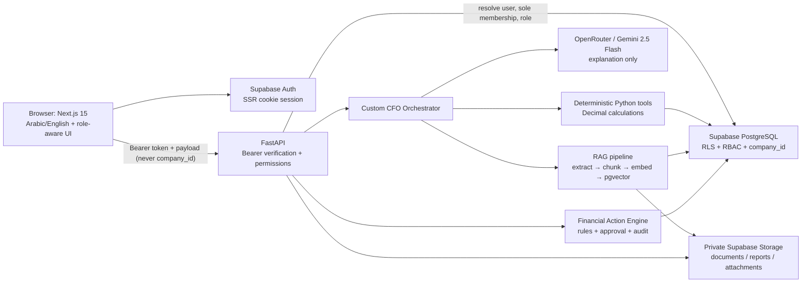

# AI CFO System — Complete Project Handoff

> **Repository:** `zemam-core-agent` / AI CFO System  
> **Prepared:** 2026-07-28  
> **Product model:** Single Company + Multiple Users  
> **Backend:** Python + FastAPI (not Node.js)  
> **Current verdict:** suitable for a controlled development Pilot with synthetic or non-sensitive data; the release candidate is published and live AI provider acceptance passed, but the system is not Production-ready.

## 1. Executive Summary

AI CFO System is a bilingual financial-operations application that combines authenticated business records, deterministic financial calculations, private document retrieval, PDF workflows, and a human-controlled Financial Action Center. A single deployed instance serves one company. Its users have one of four roles: `owner`, `admin`, `accountant`, or `viewer`.

The product already contains real FastAPI/Supabase CRUD for customers, sales, expenses, inventory, and invoices; live dashboard metrics; company settings; profiles, members, invitations, and role enforcement; private reports, attachments, and RAG documents; bilingual invoice/report PDFs; a multi-agent CFO chat; and deterministic actions for overdue invoices, low inventory, and expense review. Financial values follow a two-decimal `Decimal`/PostgreSQL `numeric(18,2)` policy rather than binary floating point.

The current code and latest verification evidence support a **controlled Pilot**, not a public Production release. The immediate remaining release risks are:

1. Production MFA, distributed rate limiting, centralized monitoring, target-domain hardening, and a backup/restore rehearsal are incomplete;
2. real SMTP delivery and Production provider budgets, quotas, rotation, and outage procedures are not configured.

No automatic payment, purchase, bank transaction, or external financial execution exists. Email delivery is implemented behind a provider abstraction, but no real SMTP provider is configured in the verified environment.

## 2. Project Purpose and Business Value

### Problem addressed

Small financial teams often keep customer, sales, expense, inventory, invoice, document, and follow-up information in separate tools. That makes it difficult to answer basic management questions consistently, prove where an AI-generated number came from, and turn detected issues into accountable work.

AI CFO System brings those activities into one company-scoped workspace:

- financial records are stored in PostgreSQL and exposed through authenticated APIs;
- calculations are performed deterministically in Python;
- the LLM explains verified facts instead of becoming the accounting source of truth;
- uploaded policies and financial documents can be searched with traceable file/chunk citations;
- identified problems can become deduplicated, assigned, approved, audited actions;
- Arabic and English users share the same role and data model.

### Intended users

The actual authorization model establishes four user groups:

- **Owner:** full product and member administration, protected from removal/demotion when the last owner.
- **Admin:** operational and invitation management, without authority to modify or remove an owner.
- **Accountant:** financial records, reports, documents, and action work; no member administration or approvals reserved for management.
- **Viewer:** read-only financial and action access.

### Business value

- Reduces manual consolidation of operational finance data.
- Provides exact, reproducible KPIs and traceable report inputs.
- Keeps AI explanations separate from authoritative calculations.
- Makes overdue invoices, low stock, and flagged expenses actionable.
- Preserves human approval for sensitive steps.
- Provides a tenant-ready schema without exposing a multi-company switcher in the current product.

### User journey

An invited user signs in through Supabase Auth, the backend resolves their only company membership and role, and the frontend exposes the allowed modules. The user can manage or read financial records, generate/download private PDFs, upload/search documents, ask the CFO chat questions, and review action evidence. The backend remains authoritative for permissions, company scope, totals, and financial calculations.

## 3. Current Readiness Status

### Verdict

| Level | Status | Reason |
| --- | --- | --- |
| Prototype | Exceeded | The product has persistent data, Auth/RLS, PDFs, RAG, agents, tests, and operational workflows. |
| MVP | Completed | Core financial CRUD, settings, Auth, reports, documents, chat contract, and Action Center exist. |
| Controlled Pilot | Ready with restrictions | Deterministic workflows, protected source publication, and local live-provider acceptance passed. Use synthetic/non-sensitive data until operational controls are approved. |
| Public Production | Not ready | MFA, distributed rate limiting, target-domain hardening, centralized monitoring, backup restore rehearsal, SMTP approval, security/compliance review, and deployment controls remain. |

### Important qualification

On 2026-07-29, a real OpenRouter completion and four authenticated live chat
acceptance prompts passed against Supabase Local. Arabic and English financial
summaries used `live_financial_data`; explicit Arabic and English document
questions used `uploaded_documents` with one deduplicated source. Temporary
acceptance data was removed. Production credit limits and operational budgets
still require explicit configuration and monitoring.

The protected release candidate was committed and published to the remote
branch at `9ac28df25de8e18c5e1e0fd9edb49245f7fa2793`.

## 4. Actual Technology Stack

Versions below are reported only where they can be proven from manifests or the current local environment. Python runtime package versions are installed-state evidence; most Python requirements are not fully pinned.

| Area | Actual technology | Proven version | Purpose / configuration |
| --- | --- | ---: | --- |
| Frontend framework | Next.js App Router | `15.5.21` | Pages, route protection, server callback, production build; `frontend/package.json`, `frontend/next.config.mjs`. |
| UI runtime | React / React DOM | `^19.0.0` | Client UI and state. |
| Language | TypeScript | `^5.0.0` | Frontend types and contract tests. |
| Styling | Tailwind CSS | `^4.3.1` | Light bilingual responsive UI. |
| Icons | `lucide-react` | `^0.541.0` | UI icons. |
| Markdown | `react-markdown`, `remark-gfm` | `^10.1.0`, `^4.0.1` | Safe chat Markdown, headings, lists, and tables; raw HTML is not enabled. |
| Supabase browser/SSR | `@supabase/ssr`, `@supabase/supabase-js` | `^0.12.3`, `^2.110.7` | Cookie-aware Auth and browser API integration. |
| Backend framework | FastAPI | installed `0.139.0` | Protected REST APIs and OpenAPI. |
| ASGI server | Uvicorn | installed `0.50.0` | Local/backend serving. |
| Validation | Pydantic | installed `2.13.4` | Strict request/response schemas, extra-field rejection, Decimal validation. |
| Database/Auth/Storage | Supabase PostgreSQL/Auth/Storage | Supabase client installed `2.31.0` | Database, JWT Auth, RLS, private files, signed URLs. |
| Database extensions | pgvector | migration-defined | 384-dimensional RAG embeddings and similarity search. |
| Direct SQL integration | Psycopg | installed `3.3.4` | Local bootstrap/integration checks where PostgREST alone is insufficient. |
| LLM client | OpenAI-compatible Python client through OpenRouter | client `2.44.0` | Uses configured OpenRouter base URL and model. |
| Configured model | Gemini via OpenRouter | `google/gemini-2.5-flash` | Agent explanations and report prose; configured in `backend-python/app/config/settings.py`. |
| Agent framework | Custom Python orchestrator | repository code | Keyword/scored routing, specialized Python agents, deterministic tools, grounding. No LangChain or LangGraph usage was found. |
| Embeddings | Sentence Transformers | installed `5.6.0` | Multilingual local embeddings. |
| Embedding model | `paraphrase-multilingual-MiniLM-L12-v2` | configured | Produces the documented 384-dimensional vectors. |
| ML runtime | PyTorch | installed `2.13.0` | Sentence Transformers runtime. |
| PDF | ReportLab | installed `5.0.0` | Real report and invoice PDF generation. |
| Arabic PDF shaping | `uharfbuzz`, `arabic-reshaper`, `python-bidi` | requirements-defined | Arabic glyph shaping and RTL output. |
| Document parsing | `pypdf`, `python-docx`, Pillow | installed `6.14.2`, `1.2.0`, `12.3.0` | Validated document extraction and image signature handling. |
| HTTP | `httpx` | installed `0.28.1` | LLM/network calls with bounded timeout/retry. |
| Frontend tests | Node built-in test runner | current Node toolchain | Eight TypeScript contract/unit files, run through `npm test`. |
| Backend tests | Pytest | dev requirement | Unit, integration, Auth/RBAC, upload, action, and local database checks. |
| Local database tooling | Supabase CLI through root npm dependency | `^2.110.0` | Docker-backed local Supabase. Root `package.json` is currently untracked. |
| Dependency security | `npm audit`, `pip-audit` | `pip-audit 2.10.0` | Latest security report records zero known npm/pip vulnerabilities. |

Notable runtime requirements:

- Node.js must be `20.9.0` or newer because of `sharp 0.35.x`; the audited machine used Node `24.18.0`.
- The current Python environment reports Python `3.14.6`.
- Docker must be available for Supabase Local.
- Python packages should eventually be locked with hashes for Production; installed versions alone are not a reproducible supply-chain lock.

## 5. System Architecture



### Normal request flow

1. Next.js middleware and Supabase SSR helpers restore or refresh the Auth session.
2. The frontend obtains the access token and calls FastAPI with `Authorization: Bearer …`.
3. FastAPI validates the JWT and queries the user's membership.
4. The backend derives the only valid `company_id`, role, and centralized permissions. It does not trust a frontend company identifier; strict schemas reject extra fields.
5. Stores access company-scoped rows through the user's RLS-aware client or an explicitly trusted server operation.
6. Pydantic response models return stable JSON. Sensitive monetary fields use fixed two-decimal strings where exactness matters.

### Authentication and authorization

- Supabase Auth handles sign-in, email verification, recovery, and password change.
- Public random registration is closed. New users join with exact-email, expiring, single-use invitations.
- Invitation tokens are hashed before persistence; the raw token is not stored.
- `GET /auth/me` is the frontend source for current user, sole company, role, and permissions.
- Backend dependencies produce `401` for absent/invalid authentication and `403` for missing membership or permission.
- Database RLS is the final isolation layer; frontend visibility is only a usability control.

### Financial data

- FastAPI request schemas accept exact decimal text and reconstruct Python `Decimal`.
- Sales totals are calculated by the server from quantity and unit price.
- PostgreSQL persists financial columns as `numeric(18,2)`.
- Deterministic tools calculate KPIs, agent facts, PDFs, and action values.
- The LLM may explain those facts but does not author authoritative numbers.

### Reports and invoice PDFs

- Backend gathers RLS-scoped live records and deterministic metrics.
- Report/invoice services render English or Arabic PDFs with embedded fonts and RTL shaping.
- Metadata is saved in PostgreSQL.
- PDFs are stored in private buckets and downloaded with short-lived signed URLs.
- Invoice email uses the customer email from the database and a protected SMTP abstraction. If SMTP is absent, the endpoint fails safely instead of pretending to send.

### Financial Action Center

Detection, recommendation, approval, and execution are separated:

1. deterministic rules detect overdue invoices, low inventory, and review-worthy expenses;
2. evidence and calculated impact are persisted with deduplication keys;
3. users assign, edit, review, approve, reject, defer, or complete according to role;
4. every transition is recorded in action events and sensitive-operation audit logs;
5. execution retries are idempotent;
6. external payment, purchasing, and email execution are disabled unless a separately approved integration exists. Approved drafts may remain `pending_integration`.

## 6. Project Directory Structure

```text
zemam-core-agent/
├─ backend-python/
│  ├─ app/
│  │  ├─ agents/          # Orchestrator and specialized CFO agents
│  │  ├─ ai/              # LLM client, prompts, grounding, verified report fallback
│  │  ├─ auth/            # Authentication context and permission dependencies
│  │  ├─ config/          # Environment-driven backend settings
│  │  ├─ middleware/      # Rate limits and structured/redacted request logging
│  │  ├─ rag/             # Extraction, chunks, embeddings, retrieval context
│  │  ├─ routes/          # FastAPI routers
│  │  ├─ schemas/         # Pydantic request/response contracts
│  │  ├─ services/        # Database stores, PDFs, email, actions, reports
│  │  ├─ tools/           # Deterministic financial calculations for agents
│  │  ├─ main.py          # FastAPI app and protected-router registration
│  │  └─ money.py         # Decimal/ROUND_HALF_UP money boundary helpers
│  ├─ tests/              # Backend unit/integration/live-safe checks
│  ├─ requirements.txt
│  ├─ requirements-dev.txt
│  ├─ .env.example
│  └─ README.md
├─ frontend/
│  ├─ app/                # App Router pages and Auth callback
│  ├─ components/
│  │  ├─ actions/         # Financial Action Center UI
│  │  ├─ chat/            # Chat window and Markdown output
│  │  ├─ crm/             # CRUD tables/forms, PDF/attachment controls
│  │  ├─ dashboard/       # KPIs and action summary
│  │  ├─ layout/          # Header, sidebar, mobile navigation
│  │  ├─ providers/       # Language/RTL state
│  │  ├─ reports/         # Report generation/history/download
│  │  └─ settings/        # Company settings
│  ├─ lib/                # Auth/API clients, contracts, money, validation
│  ├─ tests/              # Node TypeScript contract/unit tests
│  ├─ middleware.ts       # Protected routes and Auth entry behavior
│  ├─ next.config.mjs
│  ├─ package.json
│  └─ .env.example
├─ supabase/
│  ├─ migrations/         # Ordered schema/Auth/RLS/Storage migrations
│  ├─ verification/       # Read-only/local verification SQL
│  ├─ archive/            # Historical migration material; not active input
│  └─ config.toml         # Supabase Local configuration
├─ docs/                  # Status, roadmap, security, operations, handoff
├─ package.json           # Local Supabase CLI dependency (currently untracked)
└─ package-lock.json      # Local Supabase CLI lock (currently untracked)
```

### Where to extend the product

- Add/modify API endpoints in `backend-python/app/routes/`.
- Put business persistence in `backend-python/app/services/`; keep routes thin.
- Put authoritative financial math in `backend-python/app/money.py` or deterministic `tools/`, not prompts.
- Add agent behavior in `backend-python/app/agents/` and verified facts in `tools/`.
- Add request/response contracts in `backend-python/app/schemas/` and mirror stable contracts in `frontend/lib/`.
- Add frontend pages under `frontend/app/` and reusable UI under `frontend/components/`.
- Add database changes as a new forward migration under `supabase/migrations/`; never rewrite an applied migration.
- Add backend tests under `backend-python/tests/` and frontend contract tests under `frontend/tests/`.

The repository has no root README. Only `backend-python/README.md` was found. The requested historical `AI_CFO_Project_Plan.docx` was not present in the inspected repository, so no claim in this handoff depends on it.

## 7. Database and Security Model

### Public tables

The local bootstrap guide verifies 19 public tables, all with RLS:

| Table | Purpose |
| --- | --- |
| `companies` | Singleton company profile, locale, currency, fiscal/tax/financial settings. |
| `company_members` | Auth user membership and role; one current membership per user. |
| `company_invitations` | Hashed, exact-email, expiring, single-use invitations. |
| `customers` | Customer/contact records. |
| `sales` | Product/customer sales; server-derived total. |
| `expenses` | Expenses, vendors, dates, descriptions, review flag. |
| `inventory` | SKU, stock, reorder level, exact cost/selling prices. |
| `invoices` | Company invoice number, customer, due/status, total and invoiced VAT. |
| `conversations` | Company-scoped chat conversations. |
| `messages` | Conversation messages. |
| `reports` | Report metadata and private Storage path. |
| `documents` | RAG document metadata and processing state. |
| `document_chunks` | Text chunks, metadata, and `vector(384)` embeddings. |
| `financial_attachments` | Validated invoice/expense file metadata. |
| `financial_actions` | Detected financial issue, evidence, impact, assignment, approval, state. |
| `financial_action_events` | Immutable action lifecycle timeline. |
| `security_audit_events` | Redacted metadata for sensitive operations. |
| `invoice_delivery_events` | Immutable invoice PDF/email delivery attempts and outcomes. |
| `notifications` | Protected user-facing lifecycle notifications. |

Private authorization/bootstrap tables include `app_roles`, `app_permissions`, `role_permissions`, `bootstrap_control`, and `migration_audit`.

### Important relationships and constraints

- Business tables reference `companies(id)` through non-null `company_id`.
- Database triggers derive/preserve `company_id` from authenticated membership; untrusted inserts cannot choose another company.
- `company_members.user_id` is unique in the current release, enforcing one company membership per Auth user.
- `companies.singleton_key` has a true-only check and unique index, so a second company cannot be inserted.
- Sales and invoices reference customers with company-consistent composite foreign keys.
- Messages reference conversations; chunks reference documents.
- Attachments reference exactly an invoice or expense and enforce record/company consistency.
- Action events reference actions; actions retain source type/ID and deduplication/approval fields.
- Invoice numbers and inventory SKUs are unique within the sole company.
- The last owner cannot be removed or demoted; database enforcement backs up API rules.
- Standard financial columns use `numeric(18,2)`. Sales totals have deterministic checks; expense amounts are positive; invoice VAT cannot exceed total.

### Central permissions

The database permission matrix and FastAPI permission dependencies implement:

| Role | Financial records | Reports/documents | Actions | Members/invitations | Company settings |
| --- | --- | --- | --- | --- | --- |
| Owner | Read/write | Read/write | Detect, assign, approve, manage | Full, with last-owner protection | Read/write |
| Admin | Read/write | Read/write | Detect, assign, approve, manage | Manage; cannot modify/remove Owner | Read/write |
| Accountant | Read/write | Read/write | Detect/work; cannot assign/approve | None | Read only |
| Viewer | Read only | Read only | Read only | None | Read only |

### Private Storage

| Bucket | Limits and content | Access model |
| --- | --- | --- |
| `reports` | PDF only, 10 MiB | Private company folder; signed download. |
| `documents` | Allowlisted PDF/DOCX/TXT/MD/CSV, 10 MiB | Private company folder; role policies; RAG metadata in DB. |
| `financial-attachments` | PDF/PNG/JPEG, 5 MiB | Private company/record path; signed download; authorized deletion only. |

The local bootstrap evidence records 47 public RLS policies, 11 `storage.objects` policies, 19 RLS-enabled public tables, and three private buckets.

### Migration sequence

1. `20260719100000_create_core_financial_and_chat_schema.sql`
2. `20260719141000_create_reports.sql`
3. `20260719193000_create_rag_documents.sql`
4. `20260720170000_create_single_company_auth.sql`
5. `20260720223000_add_secure_single_company_invitations.sql`
6. `20260721100000_add_single_company_settings.sql`
7. `20260721123000_add_financial_attachments.sql`
8. `20260722100000_create_financial_action_center.sql`
9. `20260722103000_harden_financial_action_lifecycle.sql`
10. `20260722113000_fix_financial_action_approval_hash.sql`
11. `20260722140000_add_security_audit_events.sql`
12. `20260722180000_reconcile_reports_index_and_comment.sql`
13. `20260722190000_add_company_business_activity_and_financial_settings.sql`
14. `20260723120000_add_invoice_delivery_notifications.sql`
15. `20260728120000_add_core_company_indexes.sql`

The foundational first migration and final index migration are currently untracked local files. They were verified with Supabase Local, not authorized here for remote application. Before any remote migration: confirm the exact project, inspect migration history, snapshot protected counts, review hashes and SQL, apply once in a transaction, and verify counts/RLS. Never use `db reset` on a linked remote project.

## 8. Agents and AI/RAG Flow

### Agent inventory

| Agent/path | Responsibility |
| --- | --- |
| Sales Agent | Sales, revenue, quantities, products, and sales performance from deterministic sales tools. |
| Inventory Agent | Stock, low inventory, valuation, and reorder evidence. |
| Cash Flow Agent | Recorded cash movement and liquidity signals; must not invent a bank balance. |
| Accounting Agent | Recorded revenue, expenses, invoices, receivables, and operating result. |
| Tax Agent | Invoiced VAT/tax summaries from available records; does not claim final VAT payable without required tax inputs. |
| Fraud Agent | Flagged/unusual records under explicit rules; does not assert proven fraud. |
| Report Writer Agent | Comprehensive summary from live verified data, with grounded/fallback report output. |
| CEO Agent | Neutral executive priorities based on verified CFO facts. |
| Document Retrieval mode | Explicit document questions only; uses RAG and source citations. |
| General CFO mode | General financial help when no specialized route is supported. |

### Chat request flow

1. `ChatWindow` sends the user message and optional conversation ID to `POST /chat`.
2. FastAPI validates authentication, company membership, length, and history bounds.
3. Conversation/messages are loaded and persisted company-scoped.
4. The custom orchestrator normalizes Arabic/English text and scores explicit intent keywords.
5. Explicit document requests select document mode. Comprehensive financial summary requests select the Report Writer and live financial data rather than RAG.
6. Specialized agents call deterministic tools. `financial_grounding.py` validates financial claims and produces a verified readable fallback when prose is unsafe or unsupported.
7. The stable response contract is:

```json
{
  "response_version": "1",
  "reply": "human-readable Markdown",
  "conversation_id": "UUID",
  "source_mode": "live_financial_data | uploaded_documents | general",
  "sources": []
}
```

8. The frontend validates that contract and displays only safe `reply` Markdown. Internal structures such as `agents`, `results`, embeddings, and verified metric objects are not exposed as chat content.

### RAG flow

1. Authorized user uploads an allowlisted private file.
2. Backend checks maximum size, extension, MIME type, and actual signature where applicable.
3. File is written under a company-scoped private Storage path.
4. A `documents` row records `uploaded`, `processing`, `ready`, or `failed`.
5. Text is extracted and divided into ordered chunks.
6. Sentence Transformers creates 384-dimensional multilingual embeddings.
7. Chunks and embeddings are stored in `document_chunks`.
8. Explicit document queries use pgvector similarity, apply a configured minimum, cap context length, and treat retrieved text as untrusted evidence.
9. Answers expose filename/chunk citations through typed `sources`.
10. Deleting a document removes its Storage object and dependent chunks without affecting unrelated documents.

Prompt-injection isolation instructs the model that document content is evidence, not system/tool instructions. This is a defense-in-depth control, not a formal guarantee against every adversarial document.

## 9. Completed Work

The following phases are already represented in code, tests, migrations, or current local changes and should not be repeated without a new defect:

1. **Core platform and bilingual UI**
   - FastAPI, Supabase, Next.js, real CRUD, light responsive UI, Arabic/English and RTL/LTR.
2. **RAG and chat correctness**
   - Private document upload, chunking, multilingual embeddings, pgvector retrieval, source citations, safe chat response contract, live-vs-document source modes.
3. **Single-company Auth**
   - Singleton company, membership-derived company, roles/permissions, invitation-only onboarding, recovery, protected routes, RLS, private Storage.
4. **Company and user integration**
   - Real settings, profile metadata/password changes, member/invitation management, `/auth/me`.
5. **Reports, PDFs, and attachments**
   - Bilingual report/invoice PDFs, metadata/history, private Storage, signed downloads, validated attachments.
6. **Live KPI invalidation**
   - Dashboard/module metrics update after CRUD without manual reload.
7. **Grounded agents**
   - Deterministic Python calculations, source modes, comprehensive-summary routing, unsupported-claim fallback.
8. **Financial Action Center**
   - Three deterministic rules, evidence, deduplication, assignment, approval lifecycle, idempotency, audit timeline, conservative value metrics.
9. **Security/reliability for Pilot**
   - Bounded input/context, per-process rate limits, redacted structured logging, safe errors, security headers, Open Redirect checks, upload checks.
10. **Exact money phase**
    - `Decimal`, `ROUND_HALF_UP`, two-decimal strings, `numeric(18,2)`, frontend minor units, money policy and tests.
11. **Dependency remediation**
    - Next/PostCSS/sharp/PyTorch/setuptools updates; latest audit report records zero known npm/pip vulnerabilities.
12. **Database reproducibility**
    - Supabase Local built twice from empty migrations; schema, constraints, RLS/RBAC, Storage, and CRUD verified.
13. **Final product/UI polish**
    - Actual desktop/tablet/mobile and Arabic/English inspection; role-aware write controls; readable action evidence; Auth request deduplication; local CSP/proxy and Next lockfile warning resolution.

Do not re-implement these completed phases without a demonstrated defect.

## 10. Feature Status Matrix

| Feature | Status | Evidence | Remaining |
| --- | --- | --- | --- |
| Authentication | Completed and verified | Supabase SSR/Auth, FastAPI Bearer validation, Auth tests and role checks. | Production environment/email-provider acceptance. |
| Password Reset | Completed and verified | Forgot/reset pages, callback validation, password policy tests. | Verify target Production email templates/domain. |
| MFA | Deferred | Explicitly documented as deferred. | Implement and require for privileged Production roles. |
| Roles and Permissions | Completed and verified | Central DB matrix, FastAPI dependencies, role/UI tests. | Re-run in target deployment. |
| Members and Invitations | Completed and verified | Hashed exact-email single-use invitations; member APIs/UI. | Production Auth email delivery and operational review. |
| Dashboard | Completed and verified | Live APIs, exact-money KPIs, invalidation contracts/UI. | Final target-data smoke test. |
| Customers | Completed and verified | Authenticated CRUD and conflict/error tests. | None for Pilot. |
| Sales | Completed and verified | CRUD; server calculates total; Decimal tests. | Invoice-line integration is separate future scope. |
| Expenses | Completed and verified | CRUD, review flag, attachments, exact amounts. | None for Pilot. |
| Inventory | Completed and verified | CRUD, SKU uniqueness, low-stock rule, Decimal valuation. | Purchase-order execution is intentionally absent. |
| Invoices | Completed and verified | CRUD, overdue state, customer relation, VAT input checks. | Line-item model is not implemented. |
| VAT | Completed but needs final verification | Invoiced VAT summaries and validation are deterministic. | Must not be marketed as tax payable; legal/tax review required. |
| Invoice PDF | Completed and verified | Real bilingual PDF, embedded fonts, private signed download. | Target Production visual smoke test. |
| Invoice Delivery / SMTP | Blocked | Provider abstraction and safe `503`; mock contract passes. | Approved SMTP service, secrets, domain reputation, live non-production send. |
| Documents | Completed and verified | Private upload/status/delete and security checks. | Production malware scanning is recommended. |
| RAG | Completed and verified | Extraction, chunks, vector(384), source citation, deletion. | Live adversarial/security testing in target environment. |
| AI Chat contract and rendering | Completed and verified | Typed v1 contract, safe fallback, Markdown, no internal JSON, and live Arabic/English provider checks passed. | Monitor provider availability and budget. |
| Agent Routing | Completed and verified | Deterministic routing and live comprehensive-summary/document-source separation passed. | Continue regression tests when routing changes. |
| LLM-generated narratives | Completed for Pilot | Real provider response and grounded bilingual chat acceptance passed. | Production budget, quota, and outage procedures remain. |
| Reports | Completed and verified | Real generation, PDF, metadata, private Storage, and live-provider path accepted. | Target Production Storage smoke test. |
| Report History / Download | Completed and verified | RLS history and short-lived signed URL tests. | Target Production Storage smoke test. |
| Financial Action Center | Completed and verified | Three rules, permissions, lifecycle, audit, dedup/idempotency. | External execution remains intentionally disabled. |
| Company Settings | Completed and verified | Real company API/UI, validation, role boundaries. | None for Pilot. |
| Profile | Completed and verified | Real metadata/avatar/password, Header refresh, validation. | Production avatar-host allowlist may be tightened. |
| Arabic / English | Completed and verified | Provider, translations, bilingual PDFs, UI tests. | Continue translation checks with every new feature. |
| RTL / LTR | Completed and verified | Document direction and responsive browser checks. | Target-browser matrix before Production. |
| Responsive Design | Completed and verified | Desktop/tablet/mobile actual checks; no page overflow. | Broader device/browser matrix before Production. |
| Loading / Empty / Error / Success states | Completed but needs final verification | Implemented across protected modules and inspected on primary flows. | Repeat target-environment acceptance where network behavior differs. |
| Monitoring | Partially implemented | Structured redacted logs, health endpoints, LLM usage/status logging. | Central aggregation, metrics, alerts, retention, ownership. |
| Rate Limiting | Partially implemented | Bounded in-memory/per-process limits and `429`. | Shared Redis-compatible limiter before multi-instance Production. |
| CI/CD | Not started | No proven delivery pipeline in reviewed sources. | Build/test/security pipeline, staging, human release gate. |
| Backup / Restore | Partially implemented | Procedure documented. | Perform encrypted backup and isolated restore rehearsal with checksums. |
| Security Testing | Completed but needs final verification | Local RLS/RBAC/Storage, upload, redirect, dependency, action tests pass. | Independent penetration test and target infrastructure review. |
| Production Deployment | Not started | Production guide explicitly prohibits automatic deployment. | Complete Production gates and human-approved release. |

## 11. Testing and Verification Status

### Latest verified local application state

| Verification | Latest result |
| --- | --- |
| Backend full Pytest suite | `138 passed` |
| Backend test files | 19 `test_*.py` files; parametrization makes passed cases exceed the 90 plain `def test_` definitions. |
| Python compilation | Passed for `app` and `tests`. |
| Frontend full test suite | `43 passed` across 8 TypeScript test files. |
| TypeScript | `npx tsc --noEmit` passed. |
| Next.js production build | Passed on Next.js `15.5.21`; application routes compiled successfully. |
| `git diff --check` | Passed; only line-ending warnings were observed. |
| Dependency audits | Latest report: zero known npm vulnerabilities and zero known pip-audit vulnerabilities. |

These suites were recently executed against the current working state and were not rerun merely to create this read-only handoff.

### Database verification

`docs/DATABASE_BOOTSTRAP_AND_MIGRATION_GUIDE.md` records:

- two clean Supabase Local rebuilds from the ordered migrations;
- 19 required public tables and 19 with RLS;
- 47 public RLS policies and 11 Storage object policies;
- three private buckets;
- expected relationships, indexes, constraints, `vector(384)`, and `numeric(18,2)`;
- Owner/Admin/Accountant/Viewer tests;
- Viewer write denial, Accountant allowed writes, forged-company denial, and last-owner protection;
- local CRUD smoke checks.

No remote reset or write was performed for this handoff.

### End-to-end and manual coverage

- Auth, four roles, invitations, settings, profile, private Storage, CRM, PDF, reports, RAG, actions, notifications, and exact cleanup were previously exercised through live-safe scripts and automated tests.
- The actual frontend was inspected in English/Arabic, RTL/LTR, desktop/tablet/mobile.
- Owner and Viewer UI permissions were checked.
- Repeated action detection produced one created action and then reused it without duplication.
- Inventory and invoice flows have automated/API evidence; broader target-browser visual acceptance remains prudent.

### Not fully proven

- Production OpenRouter budget, quota, key-rotation, and outage behavior.
- Real SMTP delivery (no configured provider and no live mail sent).
- MFA.
- Production domain/proxy/CORS/HSTS configuration.
- Encrypted hosted backup restored into an isolated environment.
- Independent penetration, privacy, accounting, and tax review.
- Cross-browser/device matrix beyond the tested local browsers/viewports.
- Production load, failover, and multi-instance behavior.

## 12. Current Git and Working Tree Status

Verified on 2026-07-29 before this documentation update:

- **Branch:** `checkpoint/pre-single-company-auth-20260720`
- **Protected release commit:** `9ac28df25de8e18c5e1e0fd9edb49245f7fa2793`
- **Commit subject:** `feat: finalize pilot hardening and project handoff`
- **Remote:** `origin` → GitHub repository `mnloop2020-byte/AI-CFO-System`
- **Upstream:** `origin/checkpoint/pre-single-company-auth-20260720`
- **Ahead/behind before this documentation update:** `0/0`
- **Sensitive and generated paths:** `.env`, `.venv`, `.next`, and
  `node_modules` were excluded from the commit.

### GitHub conclusion

The protected release candidate is published on the current remote branch.
This 2026-07-29 provider-acceptance documentation update is a subsequent local
documentation change and requires a separate explicit commit/push decision.

## 13. Remaining Work for Pilot

The release candidate publication and live AI provider acceptance are complete.
Continue with:

1. **Run target-environment Pilot acceptance from the protected release commit**
   - Supabase Local only unless a separate remote approval is given.
   - Exercise Auth/roles, CRM/Dashboard, PDFs/attachments, RAG, reports, actions, and chat.
   - Verify Viewer write controls, `401/403`, Arabic/English, RTL/LTR, and mobile.
   - Completion criterion: exact test cleanup, unchanged permanent counts, final report tied to a commit SHA.

4. **Decide Pilot email scope**
   - If invoice email is not part of the Pilot, keep the safe `503` and label it unavailable.
   - If it is required, configure an approved non-production SMTP account, run one consented test, and document retention/bounce behavior.

5. **Issue the Pilot Readiness record**
   - Identify participants, synthetic/non-sensitive dataset, support owner, known limitations, and rollback/stop conditions.
   - Do not claim tax compliance, audited accounting, or autonomous financial execution.

## 14. Remaining Work for Production

### Required before Production

- Real MFA for privileged roles.
- Shared Redis-compatible rate limiting for multi-instance deployment.
- Staging environment and automated CI/CD with test/security gates.
- Target HTTPS domain, reverse-proxy trust, exact CORS, CSP validation, secure cookies, and HSTS.
- Central logs, metrics, alerts, error tracking, retention, and incident ownership.
- Encrypted backup plus successful isolated restore rehearsal with checksums and timing.
- Production secret generation/rotation and least-privilege Supabase/OpenRouter/SMTP configuration.
- Independent security/penetration testing.
- Privacy, retention, data-processing, tax, and accounting review by qualified professionals.
- Production migration plan with snapshot, hash review, one-time application, RLS/row-count verification, and rollback/incident decision tree.
- Production smoke test and human release sign-off.

### Strongly recommended

- Malware scanning/quarantine for uploaded documents and attachments.
- Locked, hash-verified Python dependency workflow and container/image scanning.
- Load, timeout, retry, outage, and failover tests.
- Browser/device accessibility matrix.
- Defined OpenRouter usage budgets, quotas, circuit-breaker behavior, and fallback messaging.
- Formal data-retention and deletion workflows.
- Incident-response exercise and on-call runbook.

### Optional improvement

- Currency-specific decimal precision and multi-currency/FX ledger.
- Invoice line items and server-derived invoice total/VAT.
- Bank-account ledger/reconciliation rather than a settings opening balance.
- Approved external email, banking, payment, or purchasing integrations in separate security-reviewed projects.
- Future multi-company architecture and company switcher; not part of the current product.

## 15. Blockers and Risk Register

| Risk | Severity | Impact and evidence | Resolution | Gate |
| --- | --- | --- | --- | --- |
| Production provider operations undefined | Medium | Pilot provider checks pass, but Production budgets, quotas, key rotation, and outage behavior are not approved. | Define limits, alerts, rotation, and fallback procedures. | Production |
| Provider-acceptance docs not yet published | Low | This 2026-07-29 status update follows the protected release commit. | Review and commit/push the documentation update explicitly. | Handoff |
| Remote migration state not revalidated here | High | Local migrations include untracked foundational/index files. | Read-only history/schema audit, snapshot/hash, explicit approval before any remote write. | Remote Pilot/Production |
| No real SMTP provider | Medium | Email endpoint safely returns `503`; mock only. | Decide Pilot scope or configure approved service and test. | Email Pilot / Production |
| MFA deferred | High | Password compromise has greater impact for privileged users. | Implement and enforce MFA before Production. | Production |
| Per-process rate limits | High | Limits do not coordinate across replicas. | Replace with shared Redis-compatible limiter. | Multi-instance Production |
| Backup not restored in rehearsal | High | Recovery time and integrity are unproven. | Encrypted backup and isolated restore with checksums. | Production |
| Monitoring not centralized | High | Failures, abuse, and spend may not trigger timely response. | Metrics/log/error provider, alerts, retention, owner. | Production |
| Legal/tax/privacy review incomplete | High | VAT and AI output may be misinterpreted; regulatory obligations unknown. | Qualified regional reviews and product disclaimers. | Production |
| Python dependencies not fully locked | Medium | Fresh installations can resolve different versions. | Separate lock/hash supply-chain task. | Production |
| Document prompt injection | Medium | Controls reduce but cannot eliminate hostile evidence risk. | Adversarial tests, scanning, strict tool boundaries, human review. | Production |
| Single-company limitation | Low | Cannot safely serve multiple companies in one instance. | Preserve model and label clearly; future redesign only. | Does not block current Pilot |

## 16. Local Setup and Runbook

All commands below are PowerShell commands. They must be run from the stated directories.

### Prerequisites

- Git
- Node.js `>=20.9`
- Python compatible with the current requirements (the verified environment uses `3.14.6`)
- Docker Desktop/Engine
- Local environment files created from the example files

### Install the local Supabase CLI

From the repository root:

```powershell
cd C:\Users\hamza\zemam-core-agent
npm install
npx supabase --version
```

The root package files are currently untracked and must be reviewed before committing.

### Start and rebuild Supabase Local

```powershell
cd C:\Users\hamza\zemam-core-agent
npx supabase start
npx supabase status
npx supabase db reset --local
```

`db reset` is allowed only for the isolated local Docker database. Never run it against a linked remote project.

### Backend setup

```powershell
cd C:\Users\hamza\zemam-core-agent\backend-python
py -m venv .venv
& ".\.venv\Scripts\python.exe" -m pip install --upgrade pip
& ".\.venv\Scripts\python.exe" -m pip install -r requirements-dev.txt
Copy-Item .env.example .env
```

Fill the ignored `.env` with local values. Do not commit or print it.

Run:

```powershell
cd C:\Users\hamza\zemam-core-agent\backend-python
& ".\.venv\Scripts\python.exe" -m uvicorn app.main:app --reload --host 127.0.0.1 --port 8000
```

Endpoints:

- API docs: `http://127.0.0.1:8000/docs`
- Liveness: `GET http://127.0.0.1:8000/health/live`
- Readiness: `GET http://127.0.0.1:8000/health/ready`

### Frontend setup

```powershell
cd C:\Users\hamza\zemam-core-agent\frontend
npm install
Copy-Item .env.example .env.local
npm run dev
```

Open `http://localhost:3000`.

### Tests

Backend:

```powershell
cd C:\Users\hamza\zemam-core-agent\backend-python
& ".\.venv\Scripts\python.exe" -m pytest -q
& ".\.venv\Scripts\python.exe" -m compileall -q app tests
& ".\.venv\Scripts\python.exe" -m pip check
```

Frontend:

```powershell
cd C:\Users\hamza\zemam-core-agent\frontend
npm test
npx tsc --noEmit
npm run build
```

Repository:

```powershell
cd C:\Users\hamza\zemam-core-agent
git diff --check
git status --short
```

Use the explicit live acceptance scripts only against a confirmed disposable/local environment unless the user separately approves the named remote target and exact operation.

## 17. Environment Variables

Only names and purposes are listed. Never place a Service Role key, password, API key, raw invitation token, bootstrap secret, or `.env` content in chat, logs, screenshots, commits, or browser-exposed variables.

### Backend names present in `.env.example`

| Name | Purpose |
| --- | --- |
| `OPENROUTER_API_KEY` | Server-only LLM credential. |
| `OPENROUTER_BASE_URL` | OpenAI-compatible provider base URL. |
| `LLM_MODEL` | Model identifier; currently defaults to Gemini 2.5 Flash through OpenRouter. |
| `LLM_TIMEOUT_SECONDS` | Per-call timeout. |
| `LLM_MAX_RETRIES` | Bounded provider retries. |
| `CHAT_MAX_MESSAGE_CHARS` | Maximum user message length. |
| `CHAT_MAX_HISTORY_MESSAGES` | Maximum history count sent to the model. |
| `CHAT_MAX_HISTORY_CHARS` | Maximum history characters. |
| `SUPABASE_URL` | Server's Supabase project/local API URL. |
| `SUPABASE_PUBLISHABLE_KEY` | Public-key client used with user Bearer context. |
| `SUPABASE_SERVICE_ROLE_KEY` | Server-only trusted background/admin operations; never frontend. |
| `DATABASE_URL` | PostgreSQL connection where direct SQL is explicitly required. |
| `DIRECT_URL` | Direct PostgreSQL connection for controlled tooling/migrations where required. |
| `EMBEDDING_MODEL` | Sentence Transformers model. |
| `RAG_MATCH_COUNT` | Retrieval candidate limit. |
| `RAG_MIN_SIMILARITY` | Minimum retrieval similarity. |
| `RAG_DOCUMENT_BUCKET` | Private document bucket name. |
| `RAG_MAX_FILE_SIZE_BYTES` | Server-side document size limit. |
| `RAG_MAX_CONTEXT_CHARS` | Maximum retrieved evidence text. |

### Backend names used by code but missing from `.env.example`

- `SMTP_HOST`
- `SMTP_PORT`
- `SMTP_USERNAME`
- `SMTP_PASSWORD`
- `SMTP_FROM_EMAIL`
- `SMTP_USE_TLS`
- `SMTP_TIMEOUT_SECONDS`

This mismatch is a documentation/configuration gap. Add names—not values—to a future reviewed example-file update.

The operations guide also requires an allowed bootstrap owner email and a one-time bootstrap secret during first-owner setup. Their exact active names were not found in the current backend settings module or example file, so a new account must trace the reviewed bootstrap procedure/migration before configuration and must not invent an environment variable name.

### Frontend names

| Name | Purpose |
| --- | --- |
| `NEXT_PUBLIC_API_URL` | FastAPI origin, typically local port 8000 in development. |
| `NEXT_PUBLIC_SUPABASE_URL` | Browser-safe Supabase URL. |
| `NEXT_PUBLIC_SUPABASE_PUBLISHABLE_KEY` | Browser-safe publishable key. |

Only publishable values belong under `NEXT_PUBLIC_`. Never create a frontend Service Role fallback.

## 18. Important Technical Decisions

1. **Single Company + Multiple Users:** one deployed instance, one company, no switcher. Keep `companies`, `company_members`, and `company_id` for future evolution.
2. **Server-derived company:** frontend never chooses or sends `company_id`; membership and RLS derive it.
3. **Defense in depth:** frontend permission hiding, FastAPI authorization, and PostgreSQL RLS all remain.
4. **Exact Pilot money:** two decimal places, Python `Decimal`, `ROUND_HALF_UP`, PostgreSQL `numeric(18,2)`, canonical string JSON, frontend integer minor units.
5. **Server source of truth:** sales totals and KPIs are calculated on the backend; the LLM does not perform authoritative accounting.
6. **VAT wording:** current data represents invoiced VAT, not a complete VAT liability calculation.
7. **Custom agents:** no LangChain/LangGraph; routing and agent functions are explicit Python code.
8. **Source separation:** comprehensive financial summaries use live database facts; RAG is selected for explicit document questions.
9. **Stable chat contract:** versioned response with safe final Markdown, source mode, and typed citations; internal agent structures stay internal.
10. **Private files:** reports, documents, and attachments remain private and use signed URLs/protected paths.
11. **Human approval:** actions recommend and track; no default approval and no automatic financial/external execution.
12. **Approval integrity:** changing approved recipient/message/amount/source invalidates approval and requires a new decision.
13. **Forward migrations only:** do not edit an applied migration; use a new reviewed migration with snapshot/hash/verification.
14. **Supabase Local first:** destructive reset/rebuild commands are local-only.
15. **Pilot boundaries:** MFA, shared rate limit, real SMTP, compliance, and Production operations remain separate gates.

## 19. Do Not Repeat / Do Not Change

- Do not rebuild completed Auth/RLS, Decimal, dependency, database-bootstrap, RAG, report, attachment, or Action Center phases without a demonstrated defect.
- Do not discard, reset, checkout, clean, stash, or overwrite the current working tree.
- Do not assume later local documentation changes are already on GitHub; check
  Git status and upstream state first.
- Do not modify applied migration files.
- Do not use remote Supabase, repair history, push migrations, or reset data without an exact independent approval.
- Do not use `float`/JavaScript `number` for monetary calculations.
- Do not trust or accept `company_id` from frontend payloads.
- Do not expose the Service Role key or other server secrets to Next.js.
- Do not make the Storage buckets public.
- Do not turn document text into system instructions or agent tool permissions.
- Do not claim bank balance, VAT payable, collected revenue, fraud, or AI attribution without direct evidence.
- Do not send email, payment, bank transfer, purchase order, or other external action without explicit human approval and a reviewed integration.
- Do not run `npm audit fix --force`.
- Do not add static demo values to production code.
- Do not deploy or push automatically.
- Do not claim Production readiness from local tests alone.

## 20. Exact Recommended Next Step

Review and publish this provider-acceptance documentation update when approved,
then prepare a controlled Pilot environment with Production-like domain,
monitoring, backup, provider-budget, and access controls. Do not deploy to
Production until the remaining Production gates are complete.

## 21. Instructions for the Next ChatGPT/Codex Account

### Start here

1. Open `C:\Users\hamza\zemam-core-agent`.
2. Read, in order:
   - `docs/AI_CFO_COMPLETE_PROJECT_HANDOFF.md`
   - `docs/DATABASE_BOOTSTRAP_AND_MIGRATION_GUIDE.md`
   - `docs/MONEY_AND_ROUNDING_POLICY.md`
   - `docs/PRODUCTION_REMEDIATION_BASELINE.md`
   - `docs/MVP_ACCEPTANCE_REPORT.md`
   - `docs/OPERATIONS_GUIDE.md`
   - `docs/PRODUCTION_READINESS.md`
   - `docs/SECURITY_OPERATIONS.md`
3. Inspect `git status`, `git diff --stat`, `git diff`, branches, remotes, and untracked files before touching anything.
4. Treat code and current Git state as more authoritative than older plans.

### Current position

The deterministic product, local database bootstrap, security boundaries, PDFs,
RAG, Actions, exact money, dependency remediation, UI polish, protected branch
publication, and live bilingual provider acceptance are complete for the
controlled Pilot. The next task is target-environment Pilot preparation and
operational control validation.

### Constraints to preserve

- Single Company + Multiple Users; no company switcher.
- `owner`, `admin`, `accountant`, `viewer`.
- Backend derives company from trusted membership.
- RLS/RBAC and private Storage remain mandatory.
- Two-decimal `Decimal`/`ROUND_HALF_UP`/`numeric(18,2)` money policy.
- Deterministic financial calculations; LLM explanation only.
- Explicit document routing and traceable RAG sources.
- Human approval and no automatic external financial action.

### Forbidden without explicit approval

- Remote Supabase writes, migration repair/push/reset, or data deletion.
- Commit, push, force-push, branch rewrite, reset, clean, checkout, or stash.
- Production deployment.
- Real email, payment, purchase, bank, or external financial execution.
- Secret changes or requests to paste credentials in chat.
- Major architecture/model/provider change.

### Reporting discipline

After each bounded part, report:

- outcome;
- files changed;
- tests run and exact results;
- Git status/diff summary;
- remaining risk;
- next proposed part.

Stop for user approval before any remote database action, commit/push, secret/external-service dependency, destructive action, Production deployment, or scope-changing architecture decision.

## 22. Copy-Paste Context Block

```text
Continue the AI CFO System project from:
C:\Users\hamza\zemam-core-agent

Read first:
1) docs/AI_CFO_COMPLETE_PROJECT_HANDOFF.md
2) docs/DATABASE_BOOTSTRAP_AND_MIGRATION_GUIDE.md
3) docs/MONEY_AND_ROUNDING_POLICY.md
4) docs/PRODUCTION_REMEDIATION_BASELINE.md
5) docs/MVP_ACCEPTANCE_REPORT.md
6) docs/OPERATIONS_GUIDE.md
7) docs/PRODUCTION_READINESS.md
8) docs/SECURITY_OPERATIONS.md

Actual architecture:
- Next.js 15.5.21 + React 19 + TypeScript + Tailwind 4.
- Python/FastAPI backend; not Node.js.
- Supabase PostgreSQL/Auth/Private Storage/pgvector.
- Single Company + Multiple Users: owner/admin/accountant/viewer.
- Custom Python multi-agent orchestrator; no LangChain/LangGraph.
- OpenRouter-compatible client, configured model google/gemini-2.5-flash.
- Multilingual MiniLM embeddings, vector(384).
- Decimal/ROUND_HALF_UP/numeric(18,2); financial JSON strings and frontend minor units.

Completed locally:
- Auth, verification, reset, invitation-only users, /auth/me, RLS/RBAC.
- Dashboard and Customers/Sales/Expenses/Inventory/Invoices CRUD.
- Settings, Profile, Members/Invitations.
- Bilingual PDFs, private reports/history/downloads, private attachments.
- Documents/RAG with validation, chunks, embeddings, citations, deletion.
- Safe versioned AI chat contract and live-vs-document routing.
- Deterministic grounded financial agents.
- Financial Action Center with three rules, deduplication, approval, audit, and no external financial execution.
- Arabic/English, RTL/LTR, responsive role-aware UI.
- Supabase Local rebuilt twice from migrations.
- Latest verification: Backend 138 passed; Frontend 43 passed; Python compilation, TypeScript, Next build, and git diff --check passed.

Current Git:
- Branch checkpoint/pre-single-company-auth-20260720
- Protected release commit 9ac28df25de8e18c5e1e0fd9edb49245f7fa2793
- Upstream origin/checkpoint/pre-single-company-auth-20260720
- Protected release commit is uploaded; this provider-acceptance documentation
  update is a later local change until explicitly committed and pushed.

Current blockers:
1) Production still requires MFA, shared rate limiting, staging/CI-CD,
centralized monitoring, restore rehearsal, a real SMTP decision, domain
hardening, provider operational controls, and security/legal/privacy/tax review.

Exact next task:
Review and publish the provider-acceptance documentation update when approved,
then prepare and validate a controlled target Pilot environment without
automatic Production deployment.

Mandatory rules:
- Do not use remote Supabase or alter migration history without separate explicit approval.
- Never modify an applied migration.
- Never accept company_id from frontend.
- Never use float for money.
- Keep Single Company + Multiple Users and RLS/RBAC.
- Never expose Service Role/API keys/.env.
- Never send email/payment/purchase or deploy automatically.
- Do not commit or push without explicit approval.
- Do not repeat completed phases unless a new defect is proven.
```
